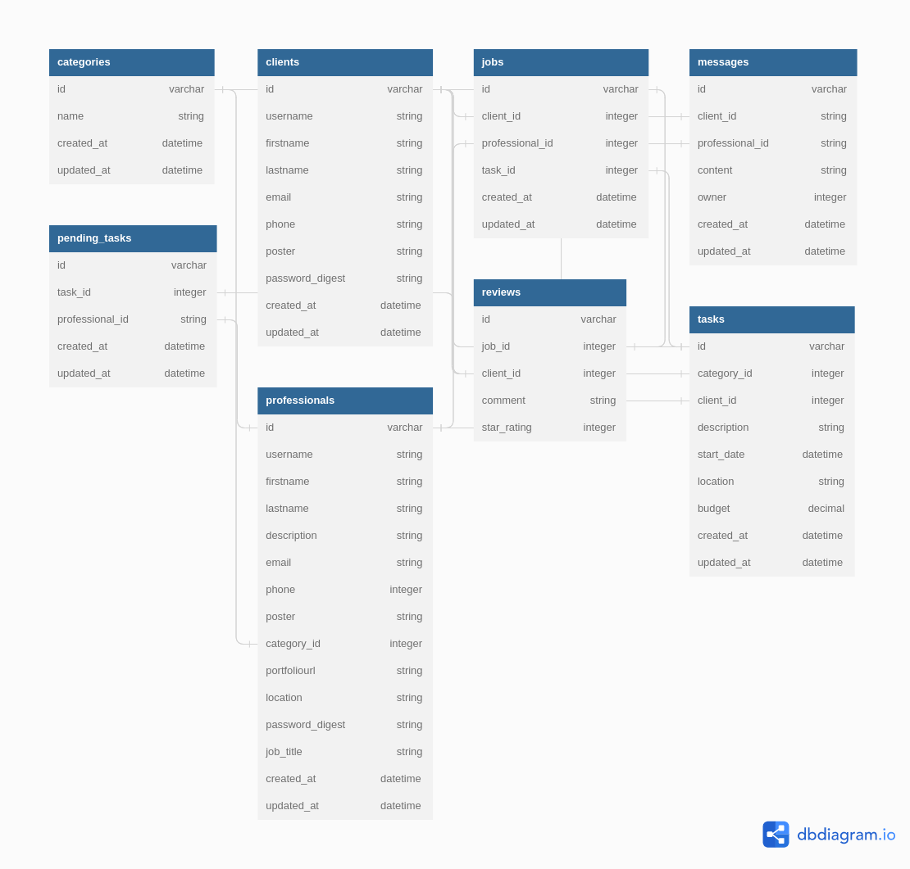

# KAZI-SKILLSET APP

## Future Developments
- Payment Integration
- Job specific reviews

## Models

    

### 1. Category
    - Health
    - Education
    - Building and Construction
    - Software services
    - Social services
        a. Cleaning
        b. Hospitality
        c. Security services
        d. Events management
        e. Gardening and landscaping
    - Other - Specify

### 2. Client
    - firstname           string
    - lastname            string
    - email               string
    - phone               integer

rails g resource Client firstname lastname email phone --no-test-framework

### 3. Professional
    - firstname           string
    - lastname            string
    - job_title           string
    - description         string
    - email               text
    - phone               integer
    - poster              string
    - category_id         integer
    - portfolio_url       string
    - location            string

rails g resource Professional firstname lastname description email phone:integer poster category_id:integer portfoliourl location --no-test-framework

### 4. Review
    - job_id              integer
    - client_id           integer
    - comment             text
    - star_rating         integer

rails g resource Review proffesional_id:integer client_id:integer comment:string star_rating:integer --no-test-framework

### 5. Job
    - client_id           integer
    - proffesional_id     integer
    - task_id             integer

rails g resource Job client_id:integer proffesional_id:integer task_id:integer  --no-test-framework

### 6. Task
    - client_id           integer
    - description         text
    - start_date          date
    - location            string
    - budget              decimal, default negotiable

rails g resource Task client_id:integer description start_date:datetime location budget:decimal --no-test-framework

### 7. Message
    - client_id             integer
    - professional_id       integer
    - content               string
    - owner                 integer

### 8. PendingTask
    - task_id           integer
    - professional_id   integer

## Jira - Project Tracking
1. Identification of the project
2. Created a rails and react project
3. Hosted the minimum source code on GitHub
4. Designed the structure and components
***
5. Create figma UI design
6. Identification of application components
7. Creating a landing page
8. Configure client side routing
9. Created Signup and Login components
10. Cards [Professional, ]
***
11. Identified the models
12. Create entity relationships
***
13. A user should be authenticated to register and login.
14. Client can can search and filter Jobs by category, location, budget, reviews, star_ratings.
15. Client can book a proffesional and cancel a task.
16. Can mark a job as incomplete or complete.
17. Client can update/patch task.
18. Reviews and star ratings about a proffesional.
***
19. Proffesional authentication to authorization.
20. Proffesional can create, update, edit profile.
21. Proffesional can accept or decline job request.
22. Switch location
***

## Front End Components
* Navbar
* Tasks route=tasks
    - ClientTask
    - ProffesionalTask4

* Footer
* Signup route=signup
* Login route=login

* JobCard - Describe contract [Complete\Incomplete - Client]
* TaskCard - Describes task [Accept/Decline - Professional, Cancel/Update - Client]

* ProfessionalCard
* Profile [include reviews] route=profiles/prof_id
* NewTaskForm
* HistoryCard -- Description previous jobs (List of jobs)

***

## Deployment
### Backend - Heroku Server

[https://kazi-skill-set-server.herokuapp.com](https://kazi-skill-set-server.herokuapp.com)  
[https://git.heroku.com/kazi-skill-set-server.git](https://git.heroku.com/kazi-skill-set-server)

### Frontend - Vercel

[https://kazi-skill-set-client.vercel.app](https://kazi-skill-set-client.vercel.app)

***

## Technologies

***

## LICENSE
MIT License 2023

******